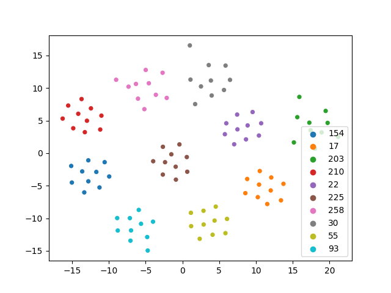

# D-Vector

This is the PyTorch implementation of speaker embedding (d-vector) trained with GE2E loss.

The original paper about GE2E loss could be found here: [Generalized End-to-End Loss for Speaker Verification](https://arxiv.org/abs/1710.10467)

## Usage

### Prepare training data

To use the script provided here, you have to organize your raw data in this way:

- all utterances from a speaker should be put under a directory (**speaker directory**)
- all speaker directories should be put under a directory (**root directory**)
- **speaker directory** can have subdirectories and utterances can be placed under subdirectories

You have to specify two things here:

- use `-s` or `--save_dir` to specify the directory for saving processed utterances
- use `-c` or `--config_path` to specify the path to the configuration for *Audiotoolkit* module

And you can specify the maximum amount of utterances to be extracted and preprocessed for a single speaker, e.g. `-m 50`.

And a good thing about this script is that you can extract utterances from multiple **root directories**.
For example:

```bash
python prepare.py -s data-dir -c toolkit_config.yaml VCTK-Corpus/wav48 LibriSpeech/train-clean-360
```

### Start training

Only `DATA_DIR`, `MODEL_DIR` and `CONFIG_PATH` have to be specified here.
For example:

```bash
python train.py data-dir model-dir dvector_config.yaml
```

Note that the configuration needed here is different from the one for preprocessing.
For more details, check the usage with `python train.py -h`.
During training, event logs will be put under `MODEL_DIR`.

### Continue training from saved checkpoints

To continue the training from a saved checkpoint, just specify the checkpoint path with `-c` or `--checkpoint_path`.
Note that you can still specify other optional arguments because they might be different from the ones in the previous training.

## Results

The dimension reduction result (using t-SNE) of some utterances from LibriSpeech.



### Credits

The GE2E-Loss module is first borrowed from [cvqluu/GE2E-Loss](https://github.com/cvqluu/GE2E-Loss) and then rewritten and optimized for speed by myself.
